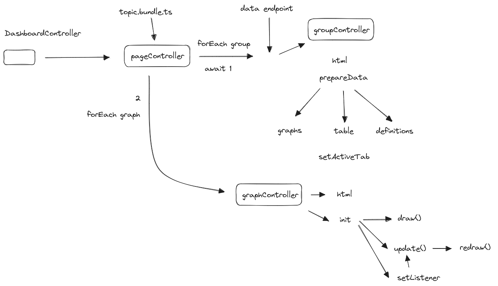

This is the codebase used for EITI-NL dataportaal. Another version is being used to update open data dashboard for Institute Mijnbouwschade Groningen. 

At present there is no boilerplate version. If you would like to re-use the codebase, do contact me at joera@joeramulders.com. I would be happy to help you strip it down and make a more generic version.

The codebase can be seen as a wrapper around d3.js, with added functionality based on best practices and other lessons learned over the years. These learnings mainly involve presenting data in multiple ways to reach a wide diversity of audiences, such as accessibility for the visually impaired, as well as a large group of people whom prefer to read numbers in tables rather than interprete graphs. 

The backend repo to this "frontend repo" can be found [here](https://github.com/Joera/eiti-server).

### Pages
The dashboard/dataportal is a single page app, that can run inside another html page(website) or hosted by itself. It only needs a html element and a script tag linking to a file of compiled typescript. Navigation between pages works through url query strings. The code related to the form of the dashboard and navigation can be found under [/src/browser/dashboard](https://github.com/Joera/EITI-Dashboard/tree/master/src/browser/dashboard).

Each page has a configuration in a ts object that could potentially be json output from a cms. [example](https://github.com/Joera/EITI-Dashboard/blob/master/src/pages/payments/config.ts) The generic [page.controller](https://github.com/Joera/EITI-Dashboard/blob/master/src/pages/shared/page.controller.ts) interpretes the page configuration and scaffolds html and ts objects for groups and graphs.  

### Groups 
A page consists of groups. Each group corresponds to a single data table (also downloadable) and a set of definitions exlaining all the parameters. I have learned that these constraints do help me focus on the message. 

A group may contain one or more graphs. One such graph can also consist of many small multiples. Groups are accompanied by a title and text field for an explanation or of textual context. Data tell stories. Organisations should not shy away from communicating their perspective on the data. 
Why are these data importnat to them. How does it inform decisionmaking. 

An important part of the group controller is to reformat the data from the endpoint into data-objects for graphs and table/download. [example](https://github.com/Joera/EITI-Dashboard/blob/55aea751ac179ec98059a53251ac3a2344fc925c/src/pages/payments/groups/payments-group-v1.ts#L36). This tends to be most of the work. I do try to use generic types. [example](https://github.com/Joera/EITI-Dashboard/blob/55aea751ac179ec98059a53251ac3a2344fc925c/src/pages/payments/groups/payments-group-v1.ts) 

### Graphs
A graph consists of the scales, a possible legend, axes and an enclosing html element, that can be given a position and size with clasess and (flexbox or css grid) styles. There is an update pattern, witha draw and a redraw method, of which the redraw method (re) runs after the size of the enclosing html element has been determined. On a browser resize the redraw method runs. Generally widths are fluid while height should be fixed, depending on breakpoints. Responsiveness works well.

The graph file [example](https://github.com/Joera/EITI-Dashboard/blob/master/src/pages/payments/graphs/revenue-bars-v1.ts) calls one or more graph elements that contain the d3.js code. [example](https://github.com/Joera/EITI-Dashboard/blob/master/src/eiti-modules/elements/svg/chart-bar-progression.ts) These elements are re-usable. There is consistency between parameters in the page configuration, data-types into the display of colours, labels: currencies, percentages etc.. 

Below you may find a schema of data flow in the application: 

